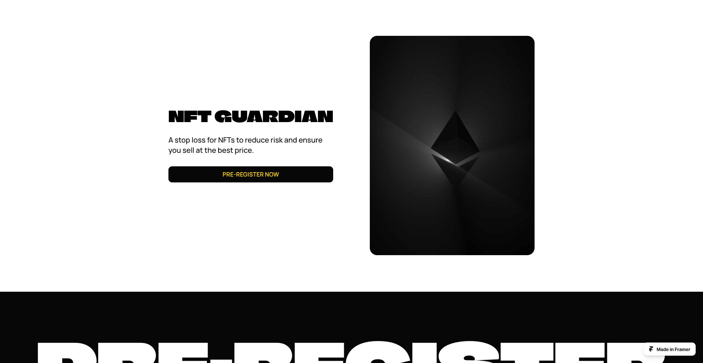
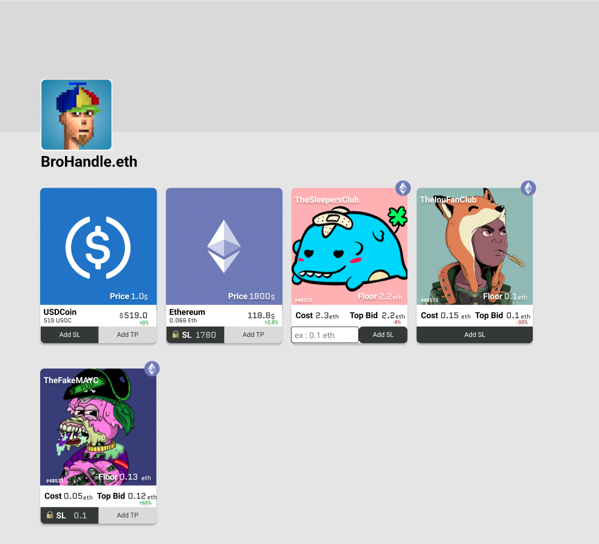

# nft-guardian

A Stop Loss order for NFTs : an automatic sell order based on the floor price

Link to landing page: https://nft-stop-loss.framer.ai/

Landing page preview :

Design on [figma](https://www.figma.com/file/Lab3PuHd9d1mcCpXJlOaPd/NFT-Guardian?type=design&node-id=77-432&mode=design&t=FHOu8SjlDiHWivN4-0)

Frontend design preview : 

### Backlog
- [x] Choose an idea
- [ ] Pick a name
- [x] Make a landing page that can capture lead -> [nft-stop-loss](https://nft-stop-loss.framer.ai/)  made with framer and loops
- [x] Start a twitter and share a first tweet
- [x] Design the app frontend -> see figma
- [ ] Design the app logic
- [ ] Start the big code (fe, ba, contract)
- [ ] Finish the big code
- [ ] (if time : add zkp for privacy and hide trades)
- [ ] Audit the code
- [ ] Record the video
- [ ] Submit
